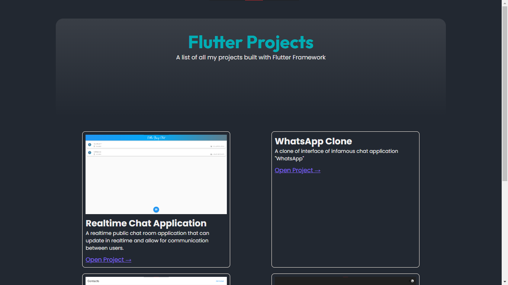

# Flutter Projects by Naresh Kumar

## 📜 Overview

A collection of all the projects I have made using the Dart flutter framework.

- **🗨 Realtime Chat-App:** a public chat room application that allows for users to anonymously communicate with each other.
- **📞 WhatsApp Clone:** a UI clone of the famous chat application "WhatsApp".
- **☎ Contacts Application:** a simple contacts management application. Features include: (Creating new contact, deleting contact, editing contact, adding to favorites).
- **🧮 Calculator Application:** a simple calculator application

## Contributors

**[Naresh Kumar](https://github.com/nareshjaipal)** - Author
